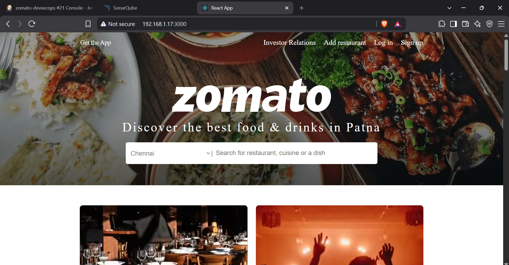
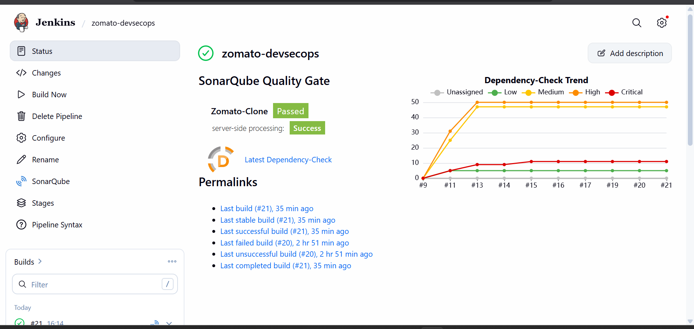
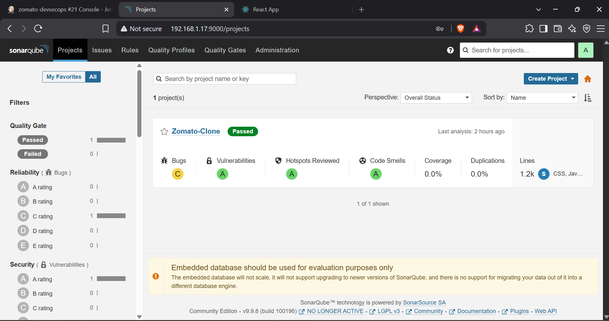
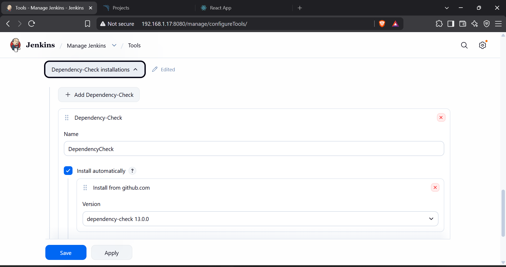

# 🍽️ Zomato Clone - Secure DevSecOps CI/CD Pipeline

<p align="center">


</p>

---

## 📌 Project Overview

This project demonstrates the secure deployment of a React-based **Zomato Clone** using a complete **DevSecOps CI/CD Pipeline**.

The primary objective is to automate the software delivery process while integrating security checks throughout the development lifecycle.

Instead of only building and deploying the application, the pipeline performs:

- Source Code Checkout
- Dependency Installation
- Application Build
- Static Code Analysis
- Dependency Vulnerability Analysis
- Filesystem Vulnerability Scan
- Docker Image Creation
- Docker Hub Publishing

This project follows modern DevSecOps practices by ensuring security is incorporated at every stage of Continuous Integration.

---

# 🚀 Live Application

The application is deployed inside a Docker Container.

```
http://localhost:3000
```

---

# 🖼 Application Preview



---

# 🏗 DevSecOps Architecture

```
Developer
    │
    ▼
GitHub Repository
    │
    ▼
Jenkins Pipeline
    │
    ├──────────────► SonarQube Analysis
    │
    ├──────────────► OWASP Dependency Check
    │
    ├──────────────► Trivy Filesystem Scan
    │
    ├──────────────► Docker Image Build
    │
    ├──────────────► Docker Hub Push
    │
    ▼
Docker Container
    │
    ▼
React Application
```

---

# ⚙ CI/CD Pipeline

The Jenkins pipeline consists of the following stages.

| Stage | Description |
|--------|-------------|
| Checkout | Pulls latest source code from GitHub |
| Node Version | Verifies NodeJS installation |
| Install Dependencies | Installs npm packages |
| Build | Builds optimized React application |
| SonarQube Analysis | Performs Static Code Analysis |
| Dependency Check | Detects vulnerable dependencies |
| Trivy Scan | Scans project filesystem for vulnerabilities |
| Docker Build | Creates Docker Image |
| Docker Push | Pushes image to Docker Hub |

---

# 📸 Jenkins Dashboard



---

# 🔍 SonarQube Analysis

The project is integrated with SonarQube for continuous code quality analysis.

Features:

- Code Smells Detection
- Bugs Detection
- Maintainability Rating
- Security Hotspots
- Quality Gate Validation



---

# 🛡 OWASP Dependency Check

OWASP Dependency Check scans third-party libraries and reports publicly known vulnerabilities (CVEs).

Features:

- CVE Detection
- NVD Database Integration
- Severity Classification
- XML Report Generation



---

# 🔐 Trivy Security Scan

Trivy performs filesystem vulnerability scanning before the Docker image is created.

Scans include:

- High Severity Vulnerabilities

- Critical Vulnerabilities

- Misconfigurations

- Secrets (optional)

---

# 🐳 Docker

The application is containerized using a multi-stage Docker build.

Benefits:

- Lightweight Image

- Faster Deployment

- Production Ready

- Isolated Runtime

---

# 📂 Project Structure

```
Zomato-Clone
│
├── public
├── src
├── assets
│
├── Dockerfile
├── Jenkinsfile
├── package.json
├── package-lock.json
└── README.md
```

---

# 🛠 Technologies Used

### Frontend

- ReactJS
- HTML
- CSS
- JavaScript

### DevOps

- Git
- GitHub
- Jenkins
- Docker
- Docker Hub

### DevSecOps

- SonarQube
- OWASP Dependency Check
- Trivy

---

# 🐳 Build Docker Image

```bash
docker build -t kartikkbhatt/zomato-clone:latest .
```

---

# 📦 Push Image

```bash
docker login

docker push kartikkbhatt/zomato-clone:latest
```

---

# ▶ Run Container

```bash
docker run -d \
--name zomato-app \
-p 3000:80 \
kartikkbhatt/zomato-clone:latest
```

---

# 📥 Pull Image

```bash
docker pull kartikkbhatt/zomato-clone:latest
```

---

# 🔄 Jenkins Workflow

```
Developer

↓

Git Push

↓

Jenkins

↓

Build

↓

SonarQube

↓

OWASP

↓

Trivy

↓

Docker Build

↓

Docker Hub

↓

Deployment
```

---

# 📈 Achievements

✔ Automated CI/CD Pipeline

✔ Static Code Analysis

✔ Dependency Vulnerability Scanning

✔ Filesystem Vulnerability Scanning

✔ Docker Image Creation

✔ Docker Hub Integration

✔ Secure Deployment Workflow

✔ Production-ready Containerized Application

---

# 👨‍💻 Author

**Kartik Brahambhatt**

Computer Science Engineering Student

DevOps | Cloud | Docker | Kubernetes | Jenkins | AWS | Terraform | Ansible

GitHub:
https://github.com/kartikbrahambhatt

Docker Hub:
https://hub.docker.com/u/kartikkbhatt

LinkedIn:
(Add your LinkedIn profile)

---

## ⭐ If you found this project useful, don't forget to star the repository.
